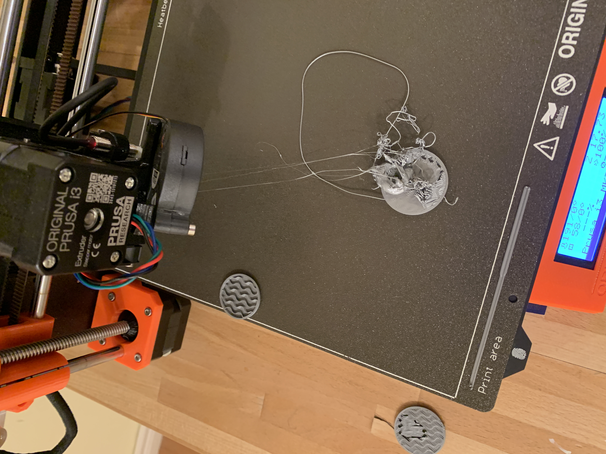
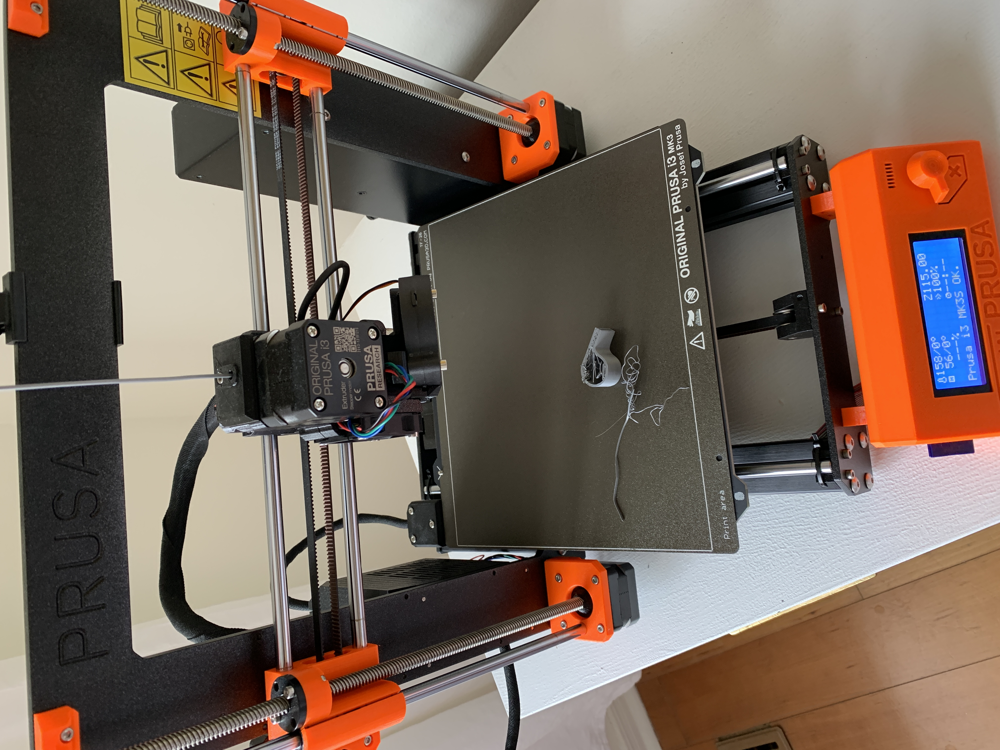
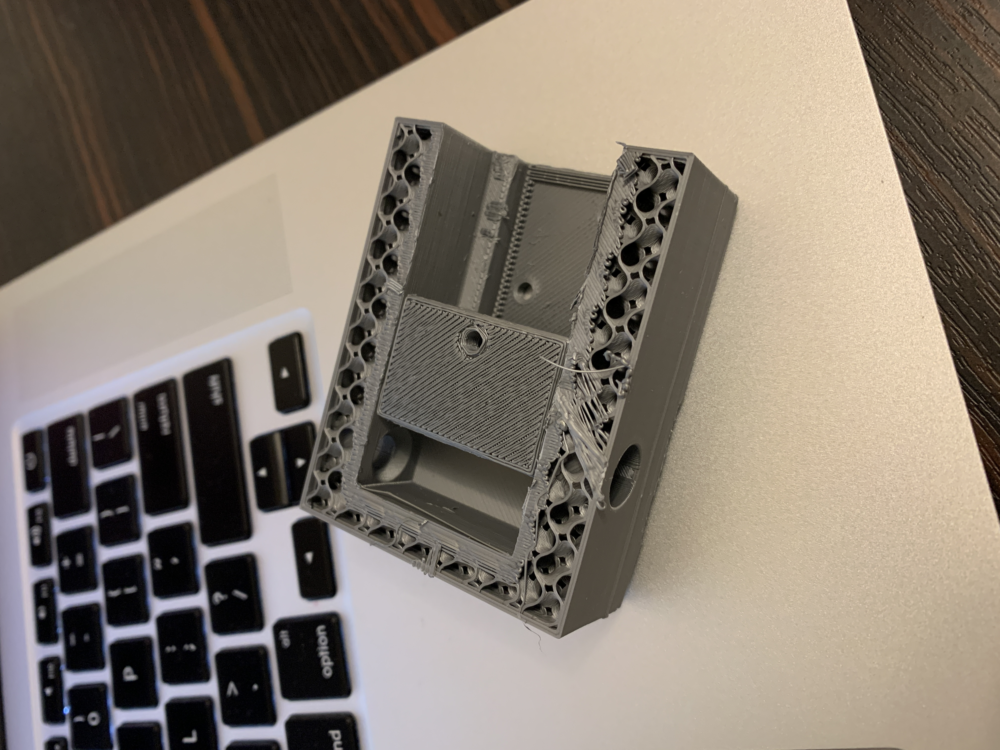
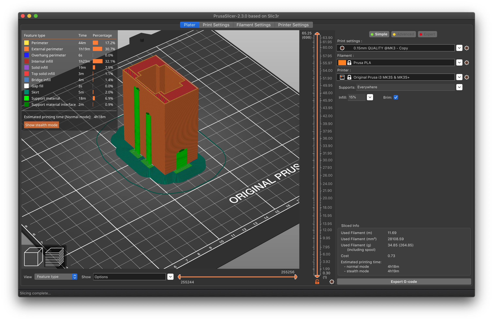
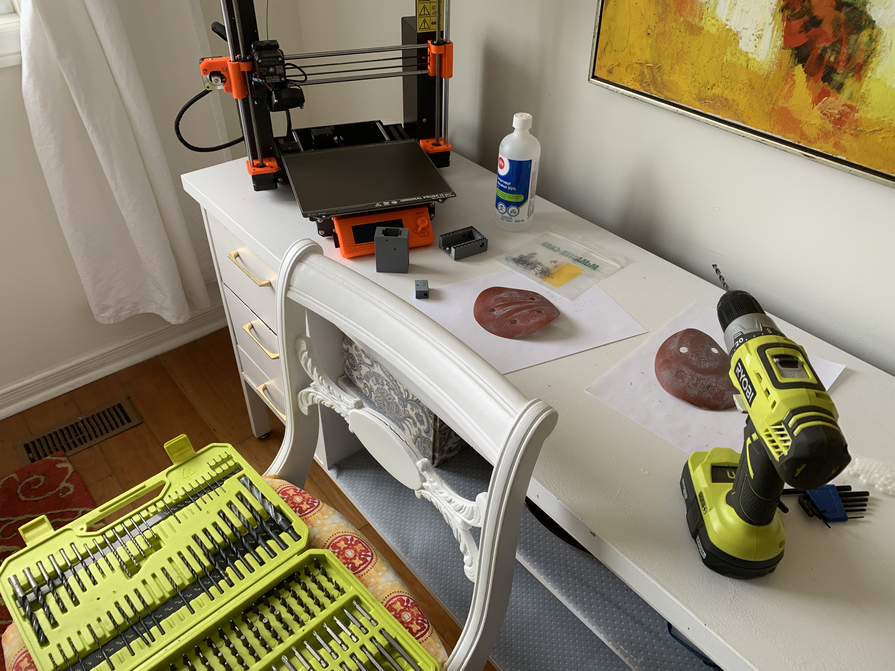
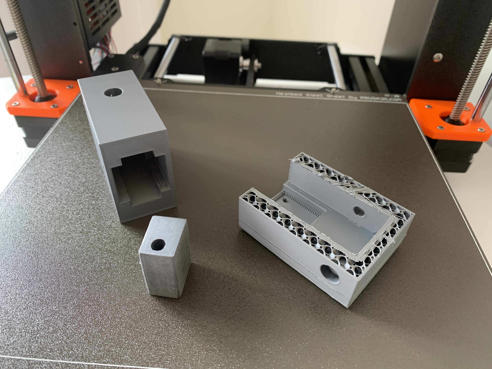

## Orderng Parts

Parts were ordered for the carrier tube and suction cup mechanisms this week.
Orders were made from Digikey and McMaster-Carr due to their excellent selection and fulfillment.

## Carrier Tube: Mechanical Assembly

Work on the carrier tube began with the rental of a 3D printer from a friend.
Took some time to get acquainted with the printer, specifically with calibrating the XYZ, leveling the bed, and fine-tuning the Z level of the extruder.
This took several days, and many prints were botched during the process
 C:\Users\leema\Desktop\Desktop\School\4B\MTE 482\biospreadr.github.io\content\images\wk1-carrier-tube-1.png

 
Getting high-quality prints from a 3D printer isn't a matter of just opening the CAD model and pressing Ctrl+P, there is quite a bit that has to be taken into account.
Even mundane things like airflow and air temperature around the printer can completely ruin the print and cost you hours of progress.
 
Eventually after many failed prints, the main body of the carrier tube and the tube itself were printed.
Parts from McMaster-Carr were received and test fits of everything were conducted.
Some sanding of the tube was required, as well as the addition of some lead-in chamfers to assist in the fit.
These improvements will be added to the CAD.
Additionally, some support material was removed from the various holes of the parts to assist in the dowel and delrin bead fit.

 
The delrin beads pass through the parts without any problems and the feed tubes have a nice fit as well.
Overall the 3D printing process is well suited to this type of design, given that it is relatively consistent (once it is fine tuned) and provides acceptable quality.
Next steps are the addition of the solenoid and system integration of the mechanical carrier tube components with the electronics and software.
